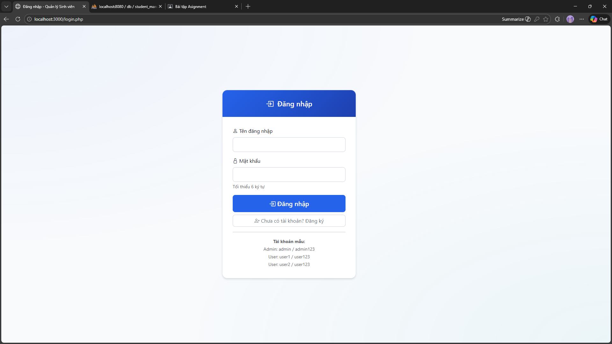
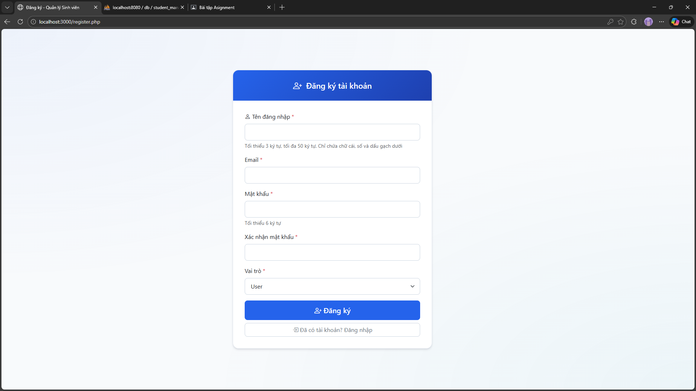
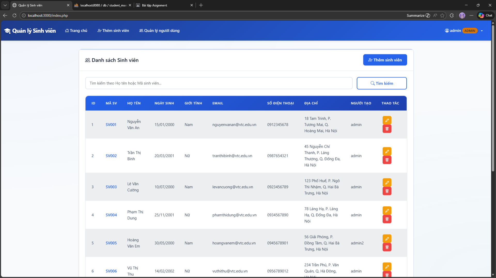
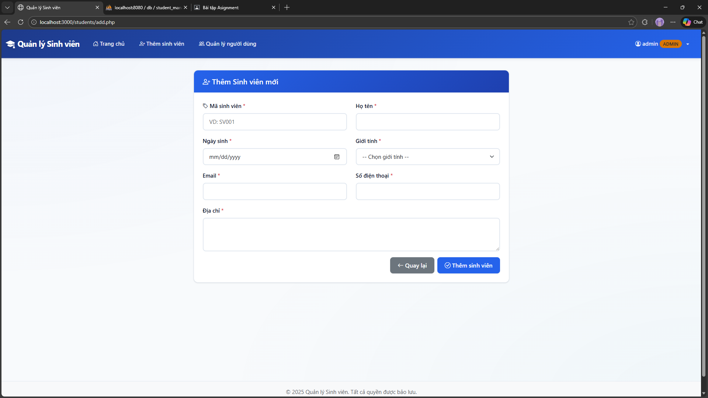
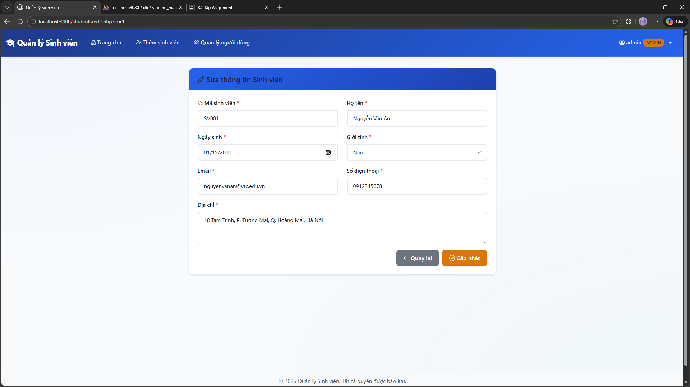
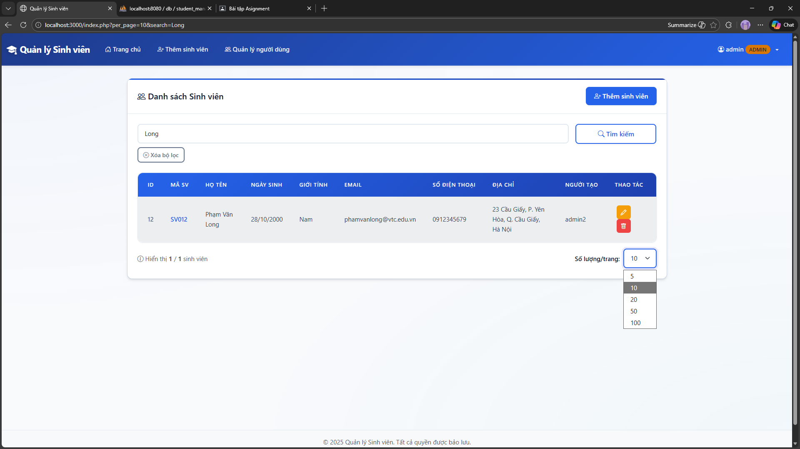
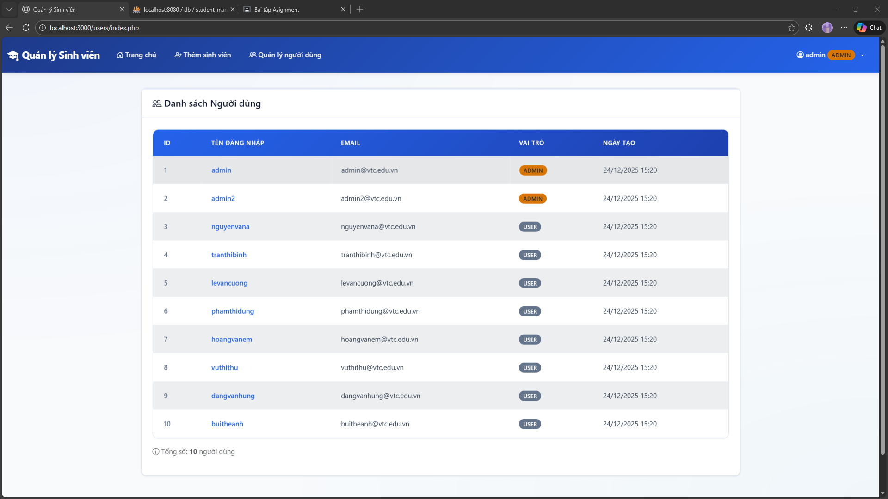
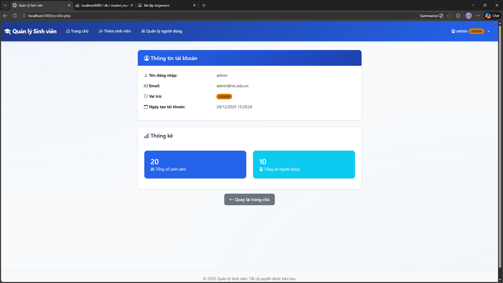

# Ứng dụng Quản lý Sinh viên - PHP Thuần

Ứng dụng web quản lý thông tin sinh viên được xây dựng bằng PHP thuần (không sử dụng framework) với các chức năng đăng ký, đăng nhập, CRUD sinh viên và phân quyền người dùng.

**Tác giả**: [github.com/lehuygiang28](https://github.com/lehuygiang28)

### Tài liệu đề bài & thiết kế

- **[docs/ASSIGNMENT_AND_DESIGN.md](docs/ASSIGNMENT_AND_DESIGN.md)** – Đề bài gốc, phân tích đề bài và giải thích tại sao code được tổ chức và triển khai như hiện tại (ý nghĩa `user_id`, phân quyền, cấu trúc file, bảo mật, seed, v.v.).

## 📋 Mục lục

- [Tài liệu đề bài & thiết kế](#tài-liệu-đề-bài--thiết-kế)
- [Tính năng](#tính-năng)
- [Yêu cầu hệ thống](#yêu-cầu-hệ-thống)
- [Cài đặt và Chạy](#cài-đặt-và-chạy)
- [Cấu hình Database](#cấu-hình-database)
- [Cấu trúc Database](#cấu-trúc-database)
- [Cấu trúc dự án](#cấu-trúc-dự-án)
- [Screenshots](#screenshots)
- [Tài khoản mẫu](#tài-khoản-mẫu)
- [Troubleshooting](#troubleshooting)

## ✨ Tính năng

### Xác thực người dùng
- ✅ Đăng ký tài khoản mới (username, password, email, role: admin hoặc user)
- ✅ Đăng nhập với session
- ✅ Đăng xuất
- ✅ Xem thông tin cá nhân (username, email, role, ngày tạo tài khoản)
- ✅ Phân quyền: Admin và User thường

### Quản lý Sinh viên
- ✅ Xem danh sách sinh viên (bảng với đầy đủ thông tin: ID, Mã SV, Họ tên, Ngày sinh, Giới tính, Email, SĐT, Địa chỉ)
- ✅ Thêm sinh viên mới (chỉ Admin)
- ✅ Sửa thông tin sinh viên (chỉ Admin)
- ✅ Xóa sinh viên với xác nhận (chỉ Admin)
- ✅ Tìm kiếm sinh viên theo Họ tên hoặc Mã sinh viên

### Phân quyền
- **User thường**: 
  - Xem tất cả danh sách sinh viên
  - Tìm kiếm sinh viên theo Họ tên hoặc Mã sinh viên
  - Xem thông tin cá nhân của mình (username, email, role, ngày tạo tài khoản)
  - Không thể thêm/sửa/xóa sinh viên
- **Admin**: 
  - Xem tất cả danh sách sinh viên
  - Tìm kiếm sinh viên theo Họ tên hoặc Mã sinh viên
  - Thực hiện tất cả thao tác CRUD trên sinh viên (thêm/sửa/xóa)
  - Xem danh sách người dùng
  - Xem thông tin cá nhân và thống kê tổng quan (tổng số sinh viên, tổng số người dùng)

## 💻 Yêu cầu hệ thống

### Phương pháp 1: Sử dụng Docker (Khuyến nghị)

- **Docker** >= 20.10
- **Docker Compose** >= 2.0
- **RAM**: Tối thiểu 2GB
- **Disk**: Tối thiểu 1GB trống

### Phương pháp 2: Cài đặt thủ công

- **PHP** >= 7.4 (khuyến nghị PHP 8.1+)
- **MySQL** >= 5.7 hoặc **MariaDB** >= 10.3
- **Apache** hoặc **Nginx** với mod_rewrite
- **PDO MySQL** extension
- **mbstring** extension

## 🚀 Cài đặt và Chạy

### Cách 1: Sử dụng Docker (Khuyến nghị)

#### Bước 1: Clone hoặc tải source code

```bash
git clone <repository-url>
cd sft
```

#### Bước 2: Khởi động containers (1 lệnh duy nhất)

```bash
# Docker Compose v2 (khuyến nghị)
docker compose up -d

# Bật thêm phpMyAdmin (chỉ dùng cho development)
docker compose --profile dev up -d
```

> Khi dùng Docker Compose, container `web` sẽ chạy script `docker-entrypoint.sh` để:
> - Đợi database `db` sẵn sàng.
> - Tự động import `database/database.sql` (schema).
> - Tự động tạo tài khoản mẫu (`scripts/init_users.php`).
> - Tự động tạo dữ liệu sinh viên mẫu (`scripts/init_students.php`) nếu bảng `users` chưa có dữ liệu.
>
> Vì vậy **bình thường chỉ cần đúng 1 lệnh `docker compose up -d`**, không cần chạy thêm các script khởi tạo/seed thủ công.

Nếu môi trường của bạn chỉ hỗ trợ `docker-compose` (Compose v1), có thể dùng:

```bash
docker-compose up -d
docker-compose --profile dev up -d
```

#### (Tuỳ chọn) Bước 3: Khởi tạo Database thủ công

Trong trường hợp bạn muốn tự điều khiển quá trình khởi tạo (hoặc đang chạy ngoài Docker), có thể chạy:

```bash
# Khởi tạo database và các bảng
docker compose exec web php scripts/init_database.php
```

#### (Tuỳ chọn) Bước 4: Seed dữ liệu mẫu thủ công

```bash
# Seed dữ liệu từ JSON (users và students)
docker compose exec web php scripts/seed_data.php
```

#### (Tuỳ chọn) Reset toàn bộ database với `DB_FORCE_INIT`

Biến môi trường `DB_FORCE_INIT` được định nghĩa trong service `web` của `docker-compose.yml`:

- **`DB_FORCE_INIT=1`**: xoá toàn bộ database `student_management` và khởi tạo + seed lại từ đầu.
- **`DB_FORCE_INIT=0` (mặc định)**: chỉ khởi tạo/seed khi chưa có user nào trong bảng `users`.

Ví dụ:

```bash
# Linux/macOS
DB_FORCE_INIT=1 docker compose up -d --build
```

```powershell
# Windows PowerShell
$env:DB_FORCE_INIT = "1"
docker compose up -d --build
```

#### Bước 5: Truy cập ứng dụng

Mở trình duyệt và truy cập:
- **URL**: http://localhost:3000
- **Trang đăng nhập**: http://localhost:3000/login.php

### Cách 2: Cài đặt thủ công

#### Bước 1: Cài đặt Web Server và Database

**Ubuntu/Debian:**
```bash
sudo apt-get update
sudo apt-get install apache2 mysql-server php php-mysql php-mbstring
sudo systemctl start apache2
sudo systemctl start mysql
```

**Windows:**
- Cài đặt XAMPP hoặc WAMP
- Khởi động Apache và MySQL từ control panel

#### Bước 2: Tạo Database

```bash
# Đăng nhập MySQL
mysql -u root -p

# Import file SQL
mysql -u root -p < database/database.sql
```

Hoặc sử dụng phpMyAdmin:
1. Mở phpMyAdmin: http://localhost/phpmyadmin
2. Import file `database/database.sql`

#### Bước 3: Cấu hình Database

Sửa file `src/config/config.php`:

```php
define('DB_HOST', 'localhost');
define('DB_NAME', 'student_management');
define('DB_USER', 'root');
define('DB_PASS', 'your_password');
```

#### Bước 4: Cấu hình Web Server

**Apache:**
1. Tạo virtual host trỏ đến thư mục `public/`
2. Bật mod_rewrite
3. Cấu hình DocumentRoot: `/path/to/sft/public`

**Nginx:**
```nginx
server {
    listen 80;
    server_name localhost;
    root /path/to/sft/public;
    index index.php;

    location / {
        try_files $uri $uri/ /index.php?$query_string;
    }

    location ~ \.php$ {
        fastcgi_pass unix:/var/run/php/php8.1-fpm.sock;
        fastcgi_index index.php;
        include fastcgi_params;
        fastcgi_param SCRIPT_FILENAME $document_root$fastcgi_script_name;
    }
}
```

#### Bước 5: Seed dữ liệu mẫu

```bash
# Seed dữ liệu từ JSON
php scripts/seed_data.php
```

## 🗄️ Cấu hình Database

### Thông tin Database (Docker)

- **Host**: `db` (trong Docker) hoặc `localhost` (cài đặt thủ công)
- **Database**: `student_management`
- **Username**: `student_user` (Docker) hoặc `root` (thủ công)
- **Password**: `student_password` (Docker) hoặc password của bạn (thủ công)
- **Port**: `3307` (Docker) hoặc `3306` (thủ công)

### Import SQL

File SQL được đặt tại: `database/database.sql`

**Với Docker:**
```bash
# File SQL tự động được import khi container khởi động lần đầu
# Nếu không, chạy:
docker-compose exec web php scripts/init_database.php
```

**Với cài đặt thủ công:**
```bash
mysql -u root -p student_management < database/database.sql
```

## 📊 Cấu trúc Database

### Bảng `users`

| Cột | Kiểu dữ liệu | Mô tả |
|-----|-------------|-------|
| `id` | INT | PRIMARY KEY, AUTO_INCREMENT |
| `username` | VARCHAR(50) | UNIQUE, Tên đăng nhập |
| `password` | VARCHAR(255) | Mật khẩu đã mã hóa bằng password_hash() |
| `email` | VARCHAR(100) | UNIQUE, Email |
| `role` | ENUM('admin', 'user') | Vai trò: admin hoặc user |
| `created_at` | TIMESTAMP | Thời gian tạo |

### Bảng `students`

| Cột | Kiểu dữ liệu | Mô tả |
|-----|-------------|-------|
| `id` | INT | PRIMARY KEY, AUTO_INCREMENT |
| `student_code` | VARCHAR(20) | UNIQUE, Mã sinh viên |
| `full_name` | VARCHAR(100) | Họ tên |
| `birthday` | DATE | Ngày sinh |
| `gender` | ENUM('Nam', 'Nữ', 'Khác') | Giới tính |
| `email` | VARCHAR(100) | Email |
| `phone` | VARCHAR(20) | Số điện thoại |
| `address` | TEXT | Địa chỉ |
| `user_id` | INT | FOREIGN KEY -> users.id (người tạo) |
| `created_at` | TIMESTAMP | Thời gian tạo |
| `updated_at` | TIMESTAMP | Thời gian cập nhật |

## 📁 Cấu trúc dự án

```
sft/
├── src/                    # Source code chính
│   ├── config/            # Cấu hình
│   │   └── config.php    # File cấu hình database và các hàm tiện ích
│   └── includes/          # Các file include chung
│       ├── header.php    # Header chung
│       └── footer.php    # Footer chung
│
├── public/                # Entry points - có thể truy cập từ web
│   ├── index.php         # Trang chủ - Danh sách sinh viên
│   ├── login.php         # Trang đăng nhập
│   ├── register.php      # Trang đăng ký
│   ├── profile.php       # Thông tin cá nhân
│   ├── auth/             # Xác thực
│   │   └── logout.php   # Xử lý đăng xuất
│   ├── students/         # Quản lý sinh viên
│   │   ├── add.php      # Thêm sinh viên
│   │   ├── edit.php     # Sửa sinh viên
│   │   └── delete.php   # Xóa sinh viên
│   └── users/            # Quản lý người dùng
│       └── index.php    # Danh sách người dùng (chỉ Admin)
│
├── database/              # Các file database
│   ├── database.sql     # File SQL tạo database và bảng
│   └── sample_data.json # Dữ liệu mẫu (JSON)
│
├── scripts/               # Script tiện ích
│   ├── init_database.php # Script khởi tạo database
│   └── seed_data.php     # Script seed dữ liệu mẫu
│
├── screenshots/           # Ảnh chụp màn hình demo
│   ├── 01-login.png      # Trang đăng nhập
│   ├── 02-register.png   # Trang đăng ký
│   ├── 03-dashboard.png  # Trang chủ - Danh sách sinh viên
│   ├── 04-add-student.png # Thêm sinh viên
│   ├── 05-edit-student.png # Sửa sinh viên
│   ├── 06-search.png     # Tìm kiếm sinh viên
│   └── 07-users-list.png # Danh sách người dùng (Admin)
│
├── Dockerfile
├── docker-compose.yml
└── README.md
```

## 📸 Screenshots

### 1. Trang đăng nhập

*Trang đăng nhập với form username và password*

### 2. Trang đăng ký

*Trang đăng ký tài khoản mới với các trường: username, email, password, role*

### 3. Trang chủ - Danh sách sinh viên

*Trang chủ hiển thị danh sách sinh viên dưới dạng bảng với đầy đủ thông tin*

### 4. Thêm sinh viên

*Form thêm sinh viên mới (chỉ Admin)*

### 5. Sửa sinh viên

*Form sửa thông tin sinh viên (chỉ Admin)*

### 6. Tìm kiếm sinh viên

*Tìm kiếm sinh viên theo Họ tên hoặc Mã sinh viên*

### 7. Danh sách người dùng (Admin)

*Trang quản lý người dùng (chỉ Admin)*

### 8. Thông tin cá nhân

*Trang xem thông tin cá nhân (username, email, role, ngày tạo, thống kê)*

> **Lưu ý**: Vui lòng thêm các ảnh chụp màn hình vào thư mục `screenshots/` với tên file tương ứng.

## 👤 Tài khoản mẫu

Sau khi seed dữ liệu, bạn có thể đăng nhập với:

### Admin
- **Username**: `admin` / **Password**: `admin123`

### User thường
- **Username**: `user1` / **Password**: `user123`
- **Username**: `user2` / **Password**: `user123`

## 🔧 Troubleshooting

### Container không khởi động

```bash
# Kiểm tra logs
docker-compose logs

# Kiểm tra trạng thái containers
docker-compose ps

# Xóa và build lại
docker-compose down
docker-compose up -d --build
```

### Lỗi "Table doesn't exist"

**Nguyên nhân**: Database chưa được khởi tạo

**Giải pháp**:
```bash
# Khởi tạo database
docker-compose exec web php scripts/init_database.php

# Sau đó seed dữ liệu
docker-compose exec web php scripts/seed_data.php
```

### Database không kết nối được

1. Kiểm tra database đã sẵn sàng:
```bash
docker-compose exec db mysqladmin ping -h localhost -u root -prootpassword
```

2. Kiểm tra environment variables:
```bash
docker-compose exec web env | grep DB_
```

### Port đã được sử dụng

Thay đổi port trong `docker-compose.yml`:
```yaml
web:
  ports:
    - "3001:80"  # Thay đổi 3001 thành port khác

db:
  ports:
    - "3308:3306"  # Thay đổi 3308 thành port khác
```

### Lỗi encoding tiếng Việt

Nếu tiếng Việt hiển thị sai:

1. Rebuild containers:
```bash
docker-compose down
docker-compose up -d --build
```

2. Xóa và import lại database:
```bash
docker-compose down -v
docker-compose up -d
docker-compose exec web php scripts/init_database.php
docker-compose exec web php scripts/seed_data.php
```

## 🔒 Bảo mật

- ✅ **SQL Injection Protection**: Sử dụng PDO với prepared statements
- ✅ **XSS Protection**: Tất cả output được escape bằng `htmlspecialchars()`
- ✅ **CSRF Protection**: Tất cả forms có CSRF token
- ✅ **Password Hashing**: Mã hóa bằng `password_hash()` (bcrypt)
- ✅ **Session Security**: HttpOnly cookies, regenerate session ID
- ✅ **Rate Limiting**: Chống brute force (tối đa 5 lần thử, khóa 5 phút)

## 📝 Validation

- ✅ **Client-side**: HTML5 validation và JavaScript
- ✅ **Server-side**: PHP validation cho tất cả input
- ✅ **Email Validation**: Sử dụng `filter_var()`
- ✅ **Phone Validation**: Pattern validation cho số điện thoại Việt Nam

## 🎨 Giao diện

- Sử dụng **Bootstrap 5.3** cho responsive design
- **Bootstrap Icons** cho các icon
- Giao diện đơn giản, sạch sẽ, dễ sử dụng
- Responsive trên mobile và tablet

---

**Tác giả**: [github.com/lehuygiang28](https://github.com/lehuygiang28)
